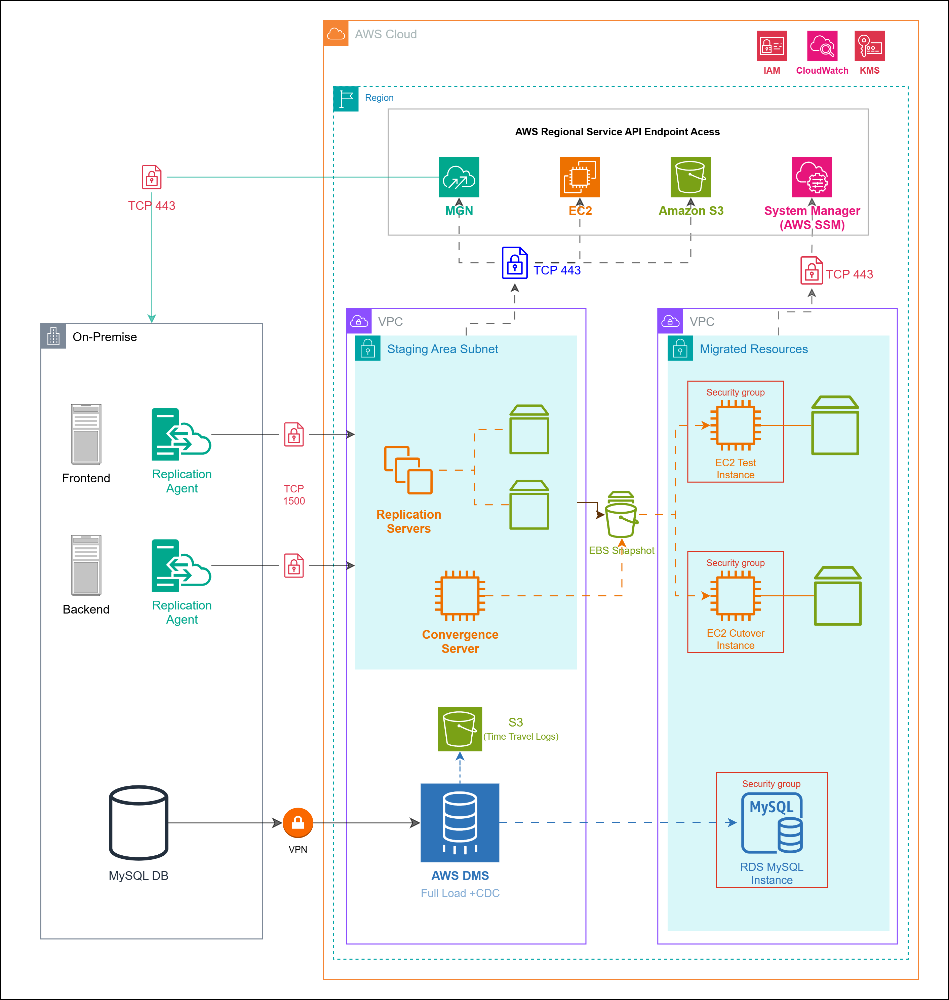
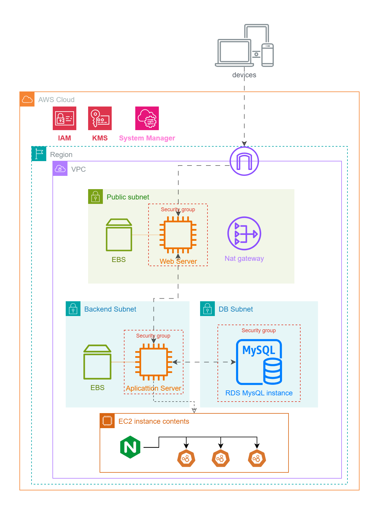
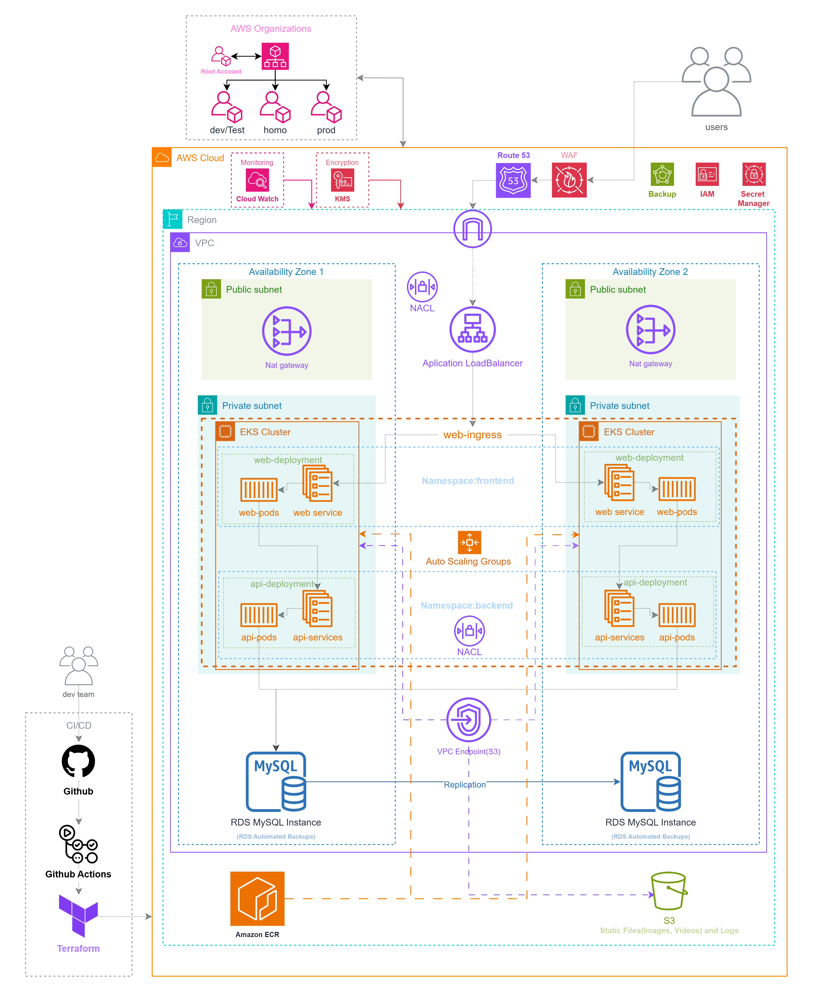

# TI Soluções Incríveis - Projeto de Migração Fast Engineering S/A

## 1. Contexto

A **Fast Engineering S/A** está migrando sua infraestrutura de eCommerce para a AWS devido a limitações de escalabilidade e desempenho.  
A infraestrutura on-premise atual inclui:

- **Banco de Dados:** 1 servidor MySQL (500GB de dados, 10GB RAM, 3 Core CPU)
- **Frontend:** 1 servidor React (5GB armazenamento, 2GB RAM, 1 Core CPU)
- **Backend:** 1 servidor com 3 APIs, Nginx (balanceador de carga), 5GB armazenamento, 4GB RAM, 2 Core CPU

**Estratégia de Migração:**
1. **Etapa 1 (Lift-and-Shift):** Replicação "As-Is" na AWS com mínimas alterações.
2. **Etapa 2 (Modernização):** Adoção de Kubernetes (EKS), CI/CD e autoscaling.

---

## 2. Etapa 1: Lift-and-Shift (As-Is)

### 2.1 Arquitetura de Migração

### 2.2 Componentes e Funcionamento

#### Rede e Segurança

- **VPC (Virtual Private Cloud)**
  - **Sub-redes Públicas:**
    - Hospedam o NAT Gateway e o Application Load Balancer (ALB)
    - Distribuídas em 2 AZs para alta disponibilidade
  - **Sub-redes Privadas:**
    - Isolam instâncias EC2 do Backend e o Banco de Dados RDS
  - **Network ACL (NACL):**
    - Regras restritivas permitindo apenas tráfego HTTPS (443) e SSH (22)
  - **WAF (Web Application Firewall):**
    - Protege o ALB contra ataques (ex.: SQL Injection, XSS)

- **Conectividade Híbrida**
  - **VPN:** Garante comunicação segura entre o ambiente on-premise e a AWS durante a migração

#### Computação e Armazenamento

- **Amazon EC2**
  - **Frontend:** Instância `t3.small` (2 vCPU, 2GB RAM) executando React; Armazenamento: Volume EBS gp2 de 10GB
  - **Backend:** Instância `t3.medium` (2 vCPU, 4GB RAM) executando APIs, com balanceamento via ALB

- **Amazon RDS (MySQL)**
  - Instância `db.t3.medium` (2 vCPU, 4GB RAM) com configuração Multi-AZ e backups diários (retenção de 7 dias)

- **Amazon S3**
  - Bucket `fast-engineering-static`: Armazena imagens, vídeos e logs, com versionamento habilitado

#### Migração de Dados

- **AWS DMS (Database Migration Service)**
  - Replica dados do MySQL on-premise para o RDS, utilizando uma instância `dms.t3.medium` e validação via checksums

- **AWS Application Migration Service**
  - Replica os servidores Frontend e Backend para instâncias EC2 por meio de snapshot contínuo

#### Monitoramento e Gestão

- **Amazon CloudWatch**
  - Coleta métricas (CPU, RAM, tráfego de rede) das instâncias EC2 e RDS
  - Configura alertas para: utilização de CPU > 80% e latência do ALB > 500ms

- **AWS IAM**
  - Define políticas de acesso mínimo:
    - EC2: Apenas leitura em S3
    - RDS: Acesso restrito (somente via APIs)

### 2.3 Ferramentas e Serviços

#### Tabela de Ferramentas e Serviços

| Ícone | Serviço | Descrição |
|:-----:|---------|-----------|
|  | **AWS Application Migration Service** | Automatiza a migração de aplicações on-premises para a AWS, simplificando o processo e minimizando o tempo de inatividade. |
|  | **Amazon EC2** | Instâncias virtuais que hospedam as aplicações migradas, proporcionando escalabilidade e flexibilidade operacional. |
|  | **Amazon S3** | Serviço de armazenamento de objetos escalável para backups, armazenamento temporário e arquivamento de dados. |
|  | **Amazon EBS** | Armazenamento em bloco para EC2, garantindo replicação fiel dos volumes de dados. |
|  | **Amazon RDS** | Banco de dados relacional gerenciado para MySQL, com alta disponibilidade e suporte Multi-AZ. |
|  | **AWS Database Migration Service (DMS)** | Facilita a migração de bancos de dados com replicação contínua e mínima interrupção, garantindo a integridade dos dados. |
|  | **Amazon VPC** | Proporciona isolamento e segmentação da rede na AWS, permitindo a criação de sub-redes, endpoints e controle de tráfego. |
|  | **AWS IAM** | Gerencia acesso e permissões de usuários e serviços, assegurando que somente operações autorizadas sejam realizadas. |
|  | **AWS Key Management Service (KMS)** | Gerencia e protege chaves de criptografia, assegurando a proteção dos dados em trânsito e em repouso. |
|  | **AWS VPN** | Estabelece conexões seguras entre o ambiente on-premise e a AWS, garantindo a transferência segura dos dados. |
|  | **Amazon CloudWatch** | Oferece monitoramento e observabilidade com coleta de métricas, logs e eventos para acompanhar a performance e integridade dos recursos. |

# Orçamento de Migração AWS - Resumo

| Serviço AWS                          | Custo Mensal (USD) | Descrição/Configuração                                                                 |
|--------------------------------------|--------------------|---------------------------------------------------------------------------------------|
| **AWS Application Migration Service** | 0,00               | 2 servidores, 6 horas/servidor.                                                      |
| **Amazon EC2 (MGN Replication)**     | 23,79              | 3 instâncias t3.medium (Linux), 40h/semana, 30 GB EBS, 18 TB entrada.                |
| **Amazon EC2 (Instâncias de Teste)** | 9,46               | 1 instância t3.small (Linux), 60% uso/mês, 5 GB EBS, 1 GB entrada/saída.             |
| **Amazon EC2 (Instância Teste 2)**   | 16,82              | 1 instância t3.medium (Linux), 60% uso/mês, 5 GB EBS, 1 GB entrada/saída.            |
| **Amazon EBS (Snapshots MGN)**       | 0,40               | 2 volumes (6 GB cada), snapshots diários, 100 MB alterados/snapshot.                 |
| **AWS DMS**                          | 164,80             | 1 instância r5.large (Single-AZ), 100 GB SSD gp2.                                    |
| **AWS KMS**                          | 3,26               | 3 chaves CMK, 85K solicitações simétricas.                                           |
| **Amazon VPC (Staging Area)**        | 49,23              | 1 VPN Site-to-Site, 18 GB entrada/mês, 1 NAT Gateway.                                |
| **Amazon VPC (Recursos Migrados)**   | 33,30              | 1 NAT Gateway, 2 GB entrada/mês.                                                     |
| **Amazon S3 (Migração)**             | 0,15               | 5 GB armazenamento (INT), 10K solicitações PUT, 3 GB entrada.                        |
| **Amazon CloudWatch**                | 9,20               | 10 GB logs, 5 métricas, 3 painéis, monitoramento DMS/MGN.                            |
| **Amazon RDS for MySQL**             | 190,65             | 1 instância db.m6g.xlarge (Single-AZ), 500 GB SSD gp2, 60% uso/mês.                  |

### Totais
- **Custo Mensal Total:** 501,06 USD  
- **Custo Anual (12 meses):** 6.012,72 USD  

[Link do Orçamento da Migração](https://calculator.aws/#/estimate?id=a130532c90c080f1ed92fa0ffc18c16b2a94db56)

## Arquitetura Lift-and-Shift

# Orçamento Pós-Migração AWS - Resumo  

| Serviço AWS                  | Custo Mensal (USD) | Descrição/Configuração                                                                 |
|------------------------------|--------------------|---------------------------------------------------------------------------------------|
| **Amazon EC2 (Frontend)**     | 8,49               | 1 instância t3a.small (Linux), 60% uso/mês, 5 GB EBS, 1 GB tráfego entrada/saída.     |
| **Amazon EC2 (Backend)**      | 16,97              | 1 instância t3a.medium (Linux), 60% uso/mês, 10 GB EBS, 3 GB saída.                   |
| **Amazon RDS for MySQL**      | 190,65             | 1 instância db.m6g.xlarge (Single-AZ), 500 GB SSD gp3, 12K IOPS, 500 MiBps throughput.|
| **AWS KMS**                   | 3,30               | 3 chaves CMK, 100K solicitações simétricas.                                           |
| **Amazon CloudWatch**         | 6,28               | 5.5 GB logs, 2 painéis, 15 métricas de alarme.                                        |
| **Amazon VPC**                | 71,29              | 1 NAT Gateway, 118 GB entrada, 100 GB saída, 1 TB tráfego intrarregião.               |

### Totais  
- **Custo Mensal Total:** 296,98 USD  
- **Custo Anual (12 meses):** 3.563,76 USD  

[Link do Orçamento da Pós-Migração](https://calculator.aws/#/estimate?id=bfcf48e230398f658823a4afa4690de4c9b81624)

---

## 3. Etapa 2: Modernização 

### 3.2 Componentes e Funcionamento

#### Kubernetes (EKS)

- **EKS Cluster**
  - **Namespaces:**
    - `frontend`: Implantação de containers React via **Deployment** com 3 réplicas
    - `backend`: Execução de APIs em containers com autoscaling (2-10 pods)
  - **Ingress Controller:**
    - Roteia tráfego via ALB (HTTP/HTTPS) com anotações para integração com WAF

- **Auto Scaling**
  - **Horizontal Pod Autoscaler (HPA):** Escala pods baseado na utilização de CPU (meta: 70%)
  - **Cluster Autoscaler:** Ajusta o número de nós do cluster conforme a demanda

#### CI/CD e Registro de Containers

- **AWS CodePipeline**
  - Fluxo: **CodeCommit** (repositório) → **CodeBuild** (build da imagem Docker) → **ECR** (registro) → **EKS** (deploy)
  - Gatilho: Push para a branch `main`

- **Amazon ECR**
  - Repositório privado para imagens Docker

#### Monitoramento Avançado

- **Amazon CloudWatch**
  - Coleta métricas customizadas do EKS (ex.: número de pods, latência de resposta)
  - Dashboards para visualização em tempo real

### 3.3 Ferramentas e Serviços

#### Tabela de Ferramentas e Serviços (Modernização)

| Ícone | Serviço | Descrição |
|:-----:|---------|-----------|
|  | **Amazon EKS** | Orquestração de containers para Frontend e Backend. |
|  | **AWS CodePipeline** | Pipeline de CI/CD que automatiza os deployments. |
|  | **Amazon ECR** | Registro de imagens Docker com escaneamento de segurança. |
|  | **Route 53** | Gerencia DNS e roteamento para o ALB. |
|  | **Amazon CloudWatch** | Monitoramento centralizado de métricas e logs. |
|  | **Amazon Backup** | Automatização de backups para EC2, EBS e RDS. |

---

## 4. Requisitos de Segurança

### Criptografia

- **Em Trânsito:** TLS 1.3 para comunicação entre ALB, EKS e RDS  
- **Em Repouso:**
  - **EBS:** Criptografia AES-256 via AWS KMS  
  - **S3:** Server-Side Encryption (SSE-S3)

### Controle de Acesso

- **IAM Roles:**
  - **EC2:** Permissão apenas para pull de imagens do ECR  
  - **EKS:** Políticas de acesso restrito aos namespaces
- **Secret Manager:**  
  - Armazena credenciais do RDS e chaves de API

### Backup e Recuperação

- **RDS:** Snapshots automáticos diários  
- **S3:** Versionamento e lifecycle policies para arquivos estáticos  
- **EKS:** Backup de configurações
- **Amazon Backup:** Automatização de backups para EC2, EBS e RDS.

---

# Orçamento AWS - Resumo

| Serviço AWS                  | Custo Mensal (USD) | Descrição/Configuração                                                                 |
|------------------------------|--------------------|---------------------------------------------------------------------------------------|
| **Amazon EKS**               | 876,00             | 2 clusters EKS, 0 nós híbridos/mês.                                                  |
| **Amazon CloudWatch**        | 6,28               | 5.5 GB logs consumidos, 2 painéis, 15 métricas de alarme.                            |
| **Amazon VPC**               | 105,80             | 118 GB entrada, 100 GB saída, 1 TB intrarregião, 2 NAT gateways.                     |
| **Amazon RDS for MySQL**     | 467,09             | 1 instância db.m5.xlarge (Multi-AZ), 500 GB SSD gp2, 60% utilização.                 |
| **Amazon Route 53**          | 287,70             | 2 zonas hospedadas, 500 registros, 500 domínios.                                     |
| **AWS CodePipeline**         | 0,30               | 1 pipeline V1, 250 minutos execução V2/mês.                                          |
| **AWS CodeBuild**            | 0,90               | 1 compilação/mês (Linux, arm1.2xlarge).                                              |
| **AWS Backup**               | -                  | 50 GB dados primários, retenção variável (35 dias a 3 meses).                        |
| **Amazon S3**                | 22,65              | 200 GB armazenamento, 5K solicitações PUT, 10K solicitações GET.                     |
| **AWS WAF**                  | 9,60               | 1 ACL web, 3 regras personalizadas, 1 grupo gerenciado.                              |
| **AWS KMS**                  | 11,00              | 5 chaves CMK, 2M solicitações simétricas.                                            |
| **Amazon ECR**               | 461,20             | 2 TB entrada, 5 TB saída, 4 GB armazenamento.                                        |
| **Elastic Load Balancing**   | 23,44              | 1 Application Load Balancer.                                                         |
| **AWS Secrets Manager**      | 0,41               | 1 segredo, 30 dias retenção, 1K chamadas API/mês.                                    |
| **Amazon EC2**               | 60,15              | 8 instâncias t3.small (Linux, compartilhadas), carga consistente.                    |

### Totais
- **Custo Inicial Total:** 0,00 USD  
- **Custo Mensal Total:** 2.337,64 USD *(ajustado após remoção do CodeDeploy)*  
- **Custo Anual (12 meses):** 28.051,68 USD
  
  [Link do Orçamento da Pós-Migração](https://calculator.aws/#/estimate?id=4905e10240762188ca7d4e71aa938b5e244010b3)
